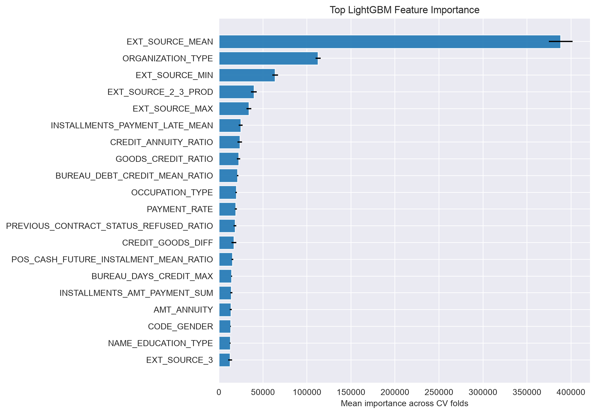
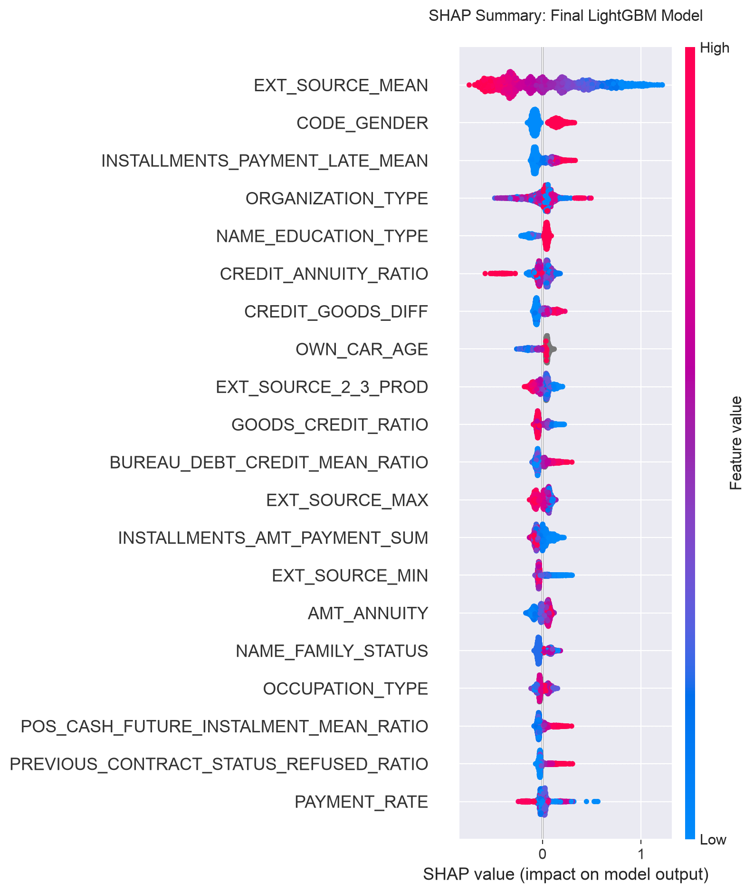

# Home Credit Default Risk

## Overview

This project builds a machine learning pipeline for the Kaggle [Home Credit Default Risk](https://www.kaggle.com/competitions/home-credit-default-risk/) competition. The goal is to predict whether an applicant will have payment difficulty using their application data, as well as secondary tables of historical credit, installment, POS, and credit-card records.

## Results

| Evaluation | ROC-AUC Score |
|---|---:|
| 5-fold OOF CV | 0.79096 |
| Kaggle public leaderboard | 0.79510 |
| Kaggle private leaderboard | 0.79007 |

## Approach

| Step                        | Summary                                                                                                           |
|-----------------------------|-------------------------------------------------------------------------------------------------------------------|
| EDA & data cleaning         | Handled data anomalies such as abnormal employment days                                                           |
| Secondary-table aggregation | Aggregated bureau, previous application, POS cash, credit card, and installment history                           |
| Feature engineering         | Added credit burden ratios, external-source interactions, document/contact counts, and repayment behavior features |
| Model                       | LightGBM                                                                                                          |
| Tuning                      | Used Optuna fast tuning on a large stratified sample                                                              |
| Validation                  | Used 5-fold cross-validation                                                                                      |

## Repository Structure

```text
.
├── data/
│   ├── raw/
│   └── processed/
├── figures/
│   ├── lgbm_feature_importance_top20.png
│   └── shap_summary_lgbm_engineered.png
├── notebook/
│   ├── eda.ipynb
│   ├── baseline_models.ipynb
│   ├── secondary_tables.ipynb
│   ├── tuning.ipynb
│   └── result_summary.ipynb
├── src/
├── requirements.txt
└── README.md
```

## Reproducibility

Install dependencies:

```bash
python -m venv .venv
source .venv/bin/activate
pip install -r requirements.txt
```

Download the Kaggle competition files and place them in `data/raw/`.

Run notebooks in order:

| Order | Notebook | Purpose |
|---:|---|---|
| 1 | `notebook/secondary_tables.ipynb` | Build secondary-table features |
| 2 | `notebook/tuning.ipynb` | Tune and validate LightGBM |
| 3 | `notebook/result_summary.ipynb` | Generate final submission and SHAP plot |

## Interpretation

### LightGBM Feature Importance



| Rank | Feature | Mean Importance | Std |
|---:|---|---:|---:|
| 1 | `EXT_SOURCE_MEAN` | 388,323 | 13,525 |
| 2 | `ORGANIZATION_TYPE` | 112,647 | 2,925 |
| 3 | `EXT_SOURCE_MIN` | 63,827 | 3,162 |
| 4 | `EXT_SOURCE_2_3_PROD` | 39,778 | 3,220 |
| 5 | `EXT_SOURCE_MAX` | 33,909 | 2,768 |
| 6 | `INSTALLMENTS_PAYMENT_LATE_MEAN` | 24,701 | 2,184 |
| 7 | `CREDIT_ANNUITY_RATIO` | 23,676 | 2,668 |
| 8 | `GOODS_CREDIT_RATIO` | 22,282 | 1,958 |
| 9 | `BUREAU_DEBT_CREDIT_MEAN_RATIO` | 21,221 | 1,006 |
| 10 | `OCCUPATION_TYPE` | 19,604 | 768 |

External credit scores are the strongest predictors of default risk; four of the top five features are derived from those scores.

### SHAP Summary



## Limitations

- The project uses a single LightGBM model, not a heavy ensemble. Future work could add a CatBoost blend to improve performance on categorical features.
- The model is optimized for ROC-AUC, not calibrated probabilities or a business-specific approval threshold.
